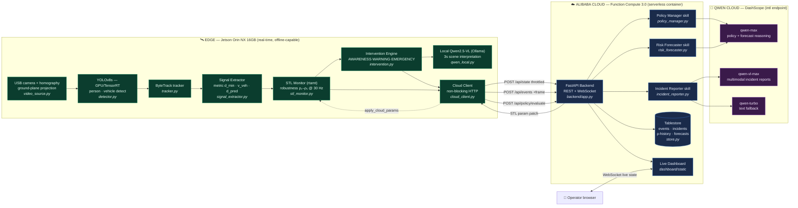
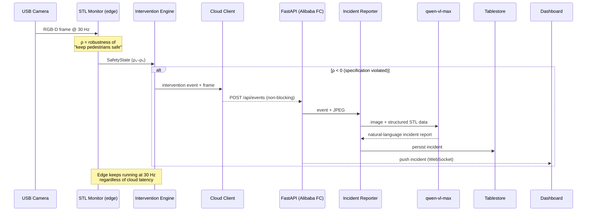
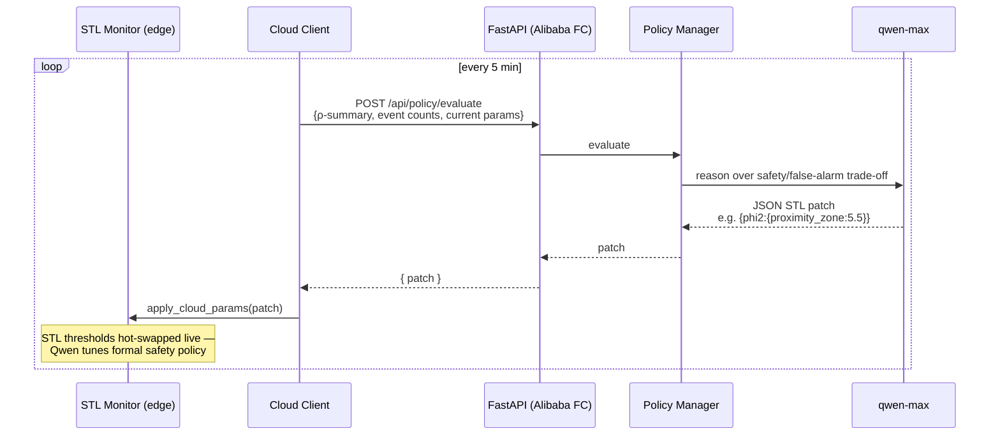

# SafeEdge — System Architecture

SafeEdge is a **formally-verified edge safety agent** (Track 5: EdgeAgent). A
real-time Signal-Temporal-Logic monitor runs autonomously on a Jetson Orin NX,
while a **Qwen-powered cloud brain deployed on Alibaba Cloud** adds multimodal
incident reporting, adaptive safety policy, and predictive risk forecasting.

The edge loop is safety-critical and **never blocks on the cloud** — if the
network or cloud is down, the Jetson keeps protecting people. The cloud adds
intelligence when available.

---

## 1. System overview

---

## 2. Safety event → Qwen incident report (sequence)

---

## 3. Adaptive policy loop (closed-loop, edge ⇄ cloud)

---

## 4. Why this architecture

| Concern | Design choice |
|---|---|
| **Real-time safety** | STL robustness computed on-device at 30 Hz; deterministic, formally grounded (no LLM in the safety-critical path). |
| **Autonomy / resilience** | `cloud_client.py` is fire-and-forget with hard timeouts — cloud outages never stall the edge loop. |
| **Sophisticated Qwen use** | Three distinct custom skills: multimodal (`qwen-vl-max`) reporting + reasoning (`qwen-max`) for policy & forecasting, returning structured JSON applied back to the formal monitor. |
| **Alibaba Cloud backend** | FastAPI on **Function Compute** (serverless container, scale-to-zero) + **Tablestore** datastore — this is the deployed backend the hackathon requires. |
| **Domain-portable** | Subjects/objects, signals, STL specs, and prompts are config-driven — the same pipeline retargets to other vision-safety domains (e.g. warehouse forklift–pedestrian). |

---

## 5. Technology stack

- **Edge:** Jetson Orin NX 16GB · JetPack 6.2 · YOLOv8s (Ultralytics, GPU) · ByteTrack (supervision) · `rtamt` (STL) · USB camera + homography · Ollama (local Qwen2.5-VL)
- **Cloud:** Alibaba Cloud Function Compute 3.0 · Tablestore · Container Registry (ACR) · FastAPI · Uvicorn
- **AI:** Qwen Cloud / DashScope (intl) — `qwen-max`, `qwen-vl-max`, `qwen-turbo`, local `qwen2.5-vl`
